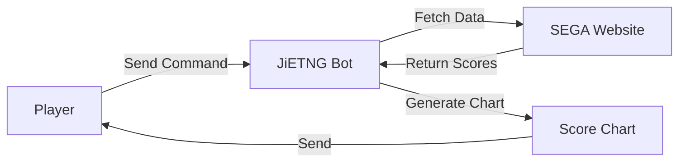

# Introduction

JiETNG is a comprehensive 『maimai でらっくす』 score management bot designed to help players track progress, analyze performance, and connect with the community.

## What is JiETNG?

JiETNG (pronounced "jie ting") is a free, feature-rich bot available on LINE that automatically tracks and manages your 『maimai でらっくす』 scores. It fetches your play data directly from the official SEGA website and presents it in beautiful, easy-to-understand visualizations.

## Core Features

### 📊 Score Tracking

- **Best 50**: Generate comprehensive charts of your best scores
- **Real-time Updates**: Sync your latest play records with a single command
- **Historical Data**: Track your progress over time
- **Accurate Calculations**: Rating calculations that conform to official standards

### 🔍 Powerful Search

- **Song Search**: Find any song by name or abbreviation
- **Advanced Filtering**: Filter by level, rating, achievement rate, and more
- **Score Details**: View detailed information for each play

### 👥 Social Features

- **Friend System**: View in-game friends' scores
- **Score Comparison**: Compare scores with friends

### 📈 Analysis Tools

- **Plate Progress**: Track your progress toward completing plates
- **Level Analysis**: View all scores for specific levels
- **Version Statistics**: See your performance across different versions

## How It Works

1. **You send a command** to JiETNG (e.g., `b50`)
2. **JiETNG fetches** your data from the official SEGA website
3. **Data is processed** and analyzed
4. **Charts are generated** and sent to you

## Platform Support

### LINE

- Large user base in Japan
- Rich UI with FlexMessage
- QuickReply for easy navigation
- Official LINE Bot features
- Multi-language support (Japanese, English, Chinese)

## Security & Privacy

Your data security is paramount:

- ✅ **Encrypted Storage**: All credentials are encrypted
- ✅ **No Third-party Access**: Your data remains private
- ✅ **Transparent**: Open development process
- ✅ **User Control**: Delete your data at any time

[Read our Privacy Policy →](/en/more/privacy)

## Tech Stack

JiETNG is built with modern, reliable technologies:

- **Backend**: Python 3.11+ with Flask
- **Messaging Platform**: python-line-bot-sdk
- **Data Storage**: Encrypted JSON database
- **Image Generation**: Pillow (PIL)
- **Web Scraping**: BeautifulSoup4, lxml

## Open Development

While JiETNG's source code is proprietary, the development process is transparent:

- 📢 Regular updates and announcements
- 🐛 Public issue tracking
- 💡 Feature requests from users
- 📖 Comprehensive documentation

## Getting Started

[Quick Start Guide →](/en/guide/getting-started)

---

Have questions? Check out our [FAQ](/en/more/faq) or [contact us](/en/more/support).
