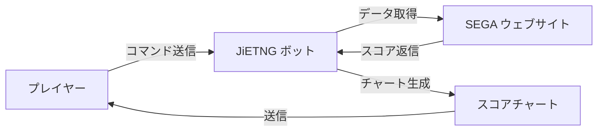

# はじめに

JiETNG は、『maimai でらっくす』 プレイヤー向けの包括的なスコア管理ボットで、進捗の追跡、パフォーマンスの分析、コミュニティとのつながりをサポートします。

## JiETNG とは？

JiETNG（発音「カイテー」）は、LINE で利用可能な無料で機能豊富なボットで、『maimai でらっくす』 のスコアを自動的に追跡・管理します。公式 SEGA ウェブサイトから直接プレイデータを取得し、美しく分かりやすいビジュアル形式で表示します。

## コア機能

### 📊 スコア追跡

- **Best 50**: 最高スコアの包括的なチャートを生成
- **リアルタイム更新**: 単一コマンドで最新のプレイ記録を同期
- **履歴データ**: 時間の経過に伴う進捗を追跡
- **正確な計算**: 公式基準に準拠したレーティング計算

### 🔍 強力な検索

- **楽曲検索**: 名前や略称で任意の楽曲を検索
- **高度なフィルタ**: レベル、レーティング、達成率などでフィルタリング
- **スコア詳細**: 各プレイの詳細情報を表示

### 👥 ソーシャル機能

- **フレンドシステム**: ゲーム内フレンドのスコアを表示
- **スコア比較**: フレンドとスコアを比較

### 📈 分析ツール

- **プレート進捗**: プレート完成への進捗を追跡
- **レベル分析**: 特定レベルのすべてのスコアを表示
- **バージョン統計**: 異なるバージョンでのパフォーマンスを確認

## 仕組み

1. **コマンドを送信**（例：`b50`）
2. **JiETNG が公式 SEGA ウェブサイトからデータを取得**
3. **データが処理・分析**される
4. **チャートが生成**されて送信される

## プラットフォームサポート

### LINE

- 日本国内のネイティブなユーザーベース
- FlexMessage によるリッチな UI
- QuickReply による便利なナビゲーション
- 公式 LINE Bot 機能
- 多言語サポート（日本語、英語、中国語）

## セキュリティとプライバシー

データのセキュリティは最優先事項です：

- ✅ **暗号化ストレージ**: すべての認証情報は暗号化
- ✅ **第三者アクセスなし**: データは非公開のまま
- ✅ **透明性**: オープンな開発プロセス
- ✅ **ユーザーコントロール**: いつでもデータを削除可能

[プライバシーポリシーを読む →](/ja/more/privacy)

## 技術スタック

JiETNG は、モダンで信頼性の高い技術で構築されています：

- **バックエンド**: Python 3.11+ with Flask
- **メッセージングプラットフォーム**: python-line-bot-sdk
- **データストレージ**: 暗号化された JSON データベース
- **画像生成**: Pillow (PIL)
- **ウェブスクレイピング**: BeautifulSoup4, lxml

## オープン開発

JiETNG のソースコードは非公開ですが、開発プロセスは透明です：

- 📢 定期的なアップデートとお知らせ
- 🐛 公開された問題追跡
- 💡 ユーザーからの機能リクエスト
- 📖 包括的なドキュメント

## 始めましょう

[クイックスタートガイド →](/ja/guide/getting-started)

---

質問がありますか？[FAQ](/ja/more/faq) をご覧いただくか、[お問い合わせ](/ja/more/support)ください。
